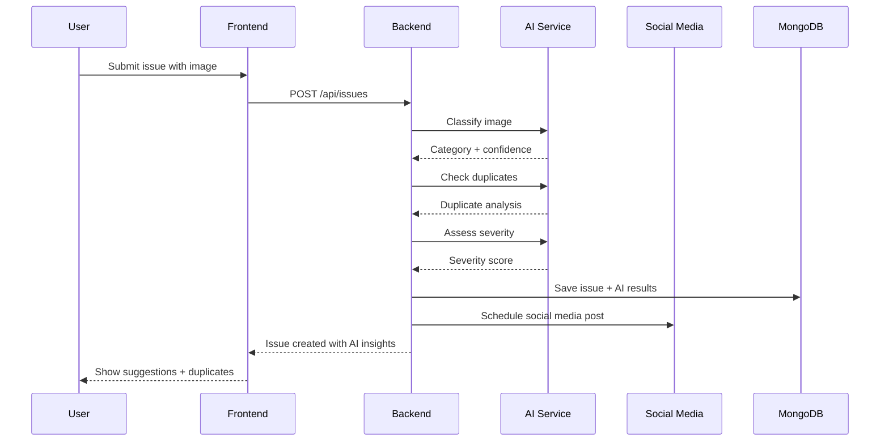
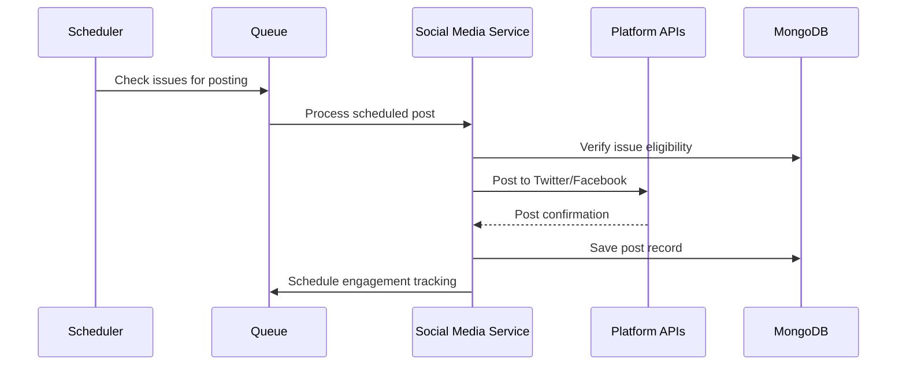

# 🏗️ CivicEye - System Design & Architecture

## 📋 Overview

CivicEye is a comprehensive civic engagement platform that empowers citizens to report civic issues and enables government officials to manage and resolve them efficiently. This document outlines the complete system architecture, including the new AI-powered analysis and social media automation features.

---

## 🎯 System Architecture

### Current Architecture

```
┌─────────────────────────────────────────────────────────────┐
│                    Frontend (React 19)                       │
│  ┌─────────────────┐  ┌─────────────────┐  ┌─────────────────┐│
│  │ Citizen Portal  │  │ Government      │  │ Admin           ││
│  │ - Issue Report  │  │ Dashboard       │  │ Dashboard       ││
│  │ - Track Issues  │  │ - Manage Issues │  │ - User Mgmt     ││
│  │ - Leaderboard   │  │ - Assign Tasks  │  │ - Analytics     ││
│  └─────────────────┘  └─────────────────┘  └─────────────────┘│
└─────────────────────────────────────────────────────────────┘
                            │ HTTP/REST API
                            ▼
┌─────────────────────────────────────────────────────────────┐
│                Backend (Node.js/Express)                     │
│  ┌─────────────────┐  ┌─────────────────┐  ┌─────────────────┐│
│  │ Auth Controller │  │ Issue Controller│  │ Admin Controller││
│  │ - Login/Signup  │  │ - CRUD Issues   │  │ - User Approval ││
│  │ - JWT Tokens    │  │ - File Upload   │  │ - Invite Links  ││
│  └─────────────────┘  └─────────────────┘  └─────────────────┘│
└─────────────────────────────────────────────────────────────┘
                            │
                            ▼
┌─────────────────────────────────────────────────────────────┐
│                   MongoDB Atlas                              │
│  ┌─────────────────┐  ┌─────────────────┐  ┌─────────────────┐│
│  │ Users           │  │ Issues          │  │ InviteTokens    ││
│  │ - Citizens      │  │ - Reports       │  │ - Gov Invites   ││
│  │ - Government    │  │ - Status        │  │ - Expiry        ││
│  │ - Admins        │  │ - Location      │  │                 ││
│  └─────────────────┘  └─────────────────┘  └─────────────────┘│
└─────────────────────────────────────────────────────────────┘
```

### Enhanced Architecture with AI & Social Media

```
┌─────────────────────────────────────────────────────────────┐
│                    Frontend (React 19)                       │
│  ┌─────────────────┐  ┌─────────────────┐  ┌─────────────────┐│
│  │ Issue Reporting │  │ AI Suggestions  │  │ Analytics       ││
│  │ with Camera     │  │ & Confidence    │  │ Dashboard       ││
│  │ - Smart Upload  │  │ - Duplicates    │  │ - AI Metrics    ││
│  │ - Location      │  │ - Severity      │  │ - Social Impact ││
│  └─────────────────┘  └─────────────────┘  └─────────────────┘│
└─────────────────────────────────────────────────────────────┘
                            │ HTTP/REST
                            ▼
┌─────────────────────────────────────────────────────────────┐
│                Backend (Node.js/Express)                     │
│  ┌─────────────────┐  ┌─────────────────┐  ┌─────────────────┐│
│  │ Issue API       │  │ Social Media    │  │ Webhook         ││
│  │ Controllers     │  │ Scheduler       │  │ Handlers        ││
│  │ + AI Integration│  │ - Auto Posting  │  │ - Engagement    ││
│  └─────────────────┘  └─────────────────┘  └─────────────────┘│
└─────────────────────────────────────────────────────────────┘
                            │
                ┌───────────┴───────────┐
                ▼                       ▼
┌──────────────────────┐    ┌──────────────────────┐
│   AI Service         │    │   Social Media       │
│   (Python/FastAPI)   │    │   Service            │
│                      │    │   (Node.js)          │
│  ┌─────────────────┐ │    │  ┌─────────────────┐ │
│  │ YOLOv8 Model    │ │    │  │ Twitter API     │ │
│  │ Image Classifier│ │    │  │ Facebook API    │ │
│  │ Duplicate Check │ │    │  │ Instagram API   │ │
│  │ Severity Score  │ │    │  │ Post Scheduler  │ │
│  │ Sentiment NLP   │ │    │  │ Engagement Track│ │
│  └─────────────────┘ │    │  └─────────────────┘ │
└──────────────────────┘    └──────────────────────┘
                │                       │
                ▼                       ▼
┌──────────────────────┐    ┌──────────────────────┐
│   MongoDB Atlas      │    │   Redis Queue        │
│   ┌─────────────────┐│    │   ┌─────────────────┐│
│   │ Issues          ││    │   │ Scheduled Posts ││
│   │ AI Results      ││    │   │ Retry Queue     ││
│   │ Social Posts    ││    │   │ Job Status      ││
│   │ Engagement Data ││    │   └─────────────────┘│
│   └─────────────────┘│    └──────────────────────┘
└──────────────────────┘
```

---

## 🗄️ Database Design

### Current Collections

#### Users Collection
```javascript
{
  _id: ObjectId,
  fullName: String,
  email: String,
  password: String, // bcrypt hashed
  role: String, // 'citizen', 'government', 'admin'
  
  // Profile Information
  phoneNumber: String,
  address: String,
  city: String,
  
  // Government-specific fields
  department: String,
  position: String,
  
  // Status and verification
  isApproved: Boolean, // For government users
  isActive: Boolean,
  
  // Gamification
  points: Number,
  level: String,
  badges: [String],
  
  createdAt: Date,
  updatedAt: Date
}
```

#### Issues Collection
```javascript
{
  _id: ObjectId,
  title: String,
  description: String,
  category: String, // 'pothole', 'garbage', 'streetlight', etc.
  severity: String, // 'low', 'medium', 'high', 'critical'
  
  // Location information
  location: {
    latitude: Number,
    longitude: Number,
    address: String,
    city: String,
    area: String
  },
  
  // Media
  imageUrl: String,
  
  // Status tracking
  status: String, // 'reported', 'assigned', 'in_progress', 'resolved', 'closed'
  assignedTo: ObjectId, // Reference to government user
  
  // User information
  reportedBy: ObjectId, // Reference to citizen user
  
  // Engagement
  upvotes: Number,
  comments: [{
    userId: ObjectId,
    comment: String,
    createdAt: Date
  }],
  
  // Timestamps
  reportedAt: Date,
  assignedAt: Date,
  resolvedAt: Date,
  
  createdAt: Date,
  updatedAt: Date
}
```

#### InviteTokens Collection
```javascript
{
  _id: ObjectId,
  token: String, // Unique invite token
  email: String, // Government official email
  department: String,
  position: String,
  createdBy: ObjectId, // Admin who created the invite
  isUsed: Boolean,
  usedBy: ObjectId, // User who used the token
  expiresAt: Date,
  createdAt: Date
}
```

### New Collections for AI & Social Media

#### AI Results Collection
```javascript
{
  _id: ObjectId,
  issueId: ObjectId, // Reference to Issue
  analysisType: String, // 'classification', 'duplicate', 'severity'
  
  // Image Classification Results
  classification: {
    category: String,
    confidence: Number,
    detectedObjects: [{
      class: String,
      confidence: Number,
      boundingBox: [Number] // [x1, y1, x2, y2]
    }],
    suggestions: [{
      category: String,
      confidence: Number
    }],
    processingTime: Number
  },
  
  // Duplicate Detection Results
  duplicateAnalysis: {
    isDuplicate: Boolean,
    similarIssues: [{
      issueId: ObjectId,
      similarityScore: Number,
      distanceMeters: Number,
      imageSimilarity: Number,
      textSimilarity: Number,
      locationSimilarity: Number
    }],
    recommendation: String // 'new_issue', 'duplicate', 'similar'
  },
  
  // Severity Assessment Results
  severityAnalysis: {
    severity: String, // 'critical', 'high', 'medium', 'low'
    confidence: Number,
    factors: {
      visualSeverity: Number,
      locationContext: Number,
      safetyRisk: Number,
      impactArea: Number
    },
    reasoning: String,
    escalationRequired: Boolean
  },
  
  createdAt: Date,
  updatedAt: Date
}
```

#### Social Media Posts Collection
```javascript
{
  _id: ObjectId,
  issueId: ObjectId, // Reference to Issue
  platform: String, // 'twitter', 'facebook', 'instagram'
  postId: String, // Platform-specific post ID
  content: String, // Posted content
  mediaUrls: [String], // Attached media URLs
  
  // Scheduling information
  scheduledFor: Date,
  postedAt: Date,
  status: String, // 'scheduled', 'published', 'failed', 'cancelled'
  
  // Engagement metrics
  engagement: {
    likes: Number,
    shares: Number,
    comments: Number,
    retweets: Number, // Twitter specific
    reactions: { // Facebook specific
      like: Number,
      love: Number,
      angry: Number,
      sad: Number
    },
    lastUpdated: Date
  },
  
  // Posting metadata
  postingRule: String, // Which rule triggered this post
  priority: String, // 'high', 'medium', 'low'
  retryCount: Number,
  
  createdAt: Date,
  updatedAt: Date
}
```

---

## 🔧 API Design

### Current API Endpoints

#### Authentication Endpoints
```
POST /api/auth/citizen-signup    # Citizen registration
POST /api/auth/government-signup # Government registration (with invite)
POST /api/auth/login            # User login
POST /api/auth/logout           # User logout
GET  /api/auth/me               # Get current user
```

#### Issue Management Endpoints
```
GET    /api/issues              # Get all issues (with filters)
POST   /api/issues              # Create new issue
GET    /api/issues/:id          # Get specific issue
PUT    /api/issues/:id          # Update issue
DELETE /api/issues/:id          # Delete issue
POST   /api/issues/:id/upvote   # Upvote issue
POST   /api/issues/:id/comment  # Add comment
```

#### Admin Endpoints
```
GET  /api/admin/users           # Get all users
PUT  /api/admin/users/:id       # Update user (approve/reject)
POST /api/admin/invite          # Create government invite
GET  /api/admin/stats           # Get system statistics
```

#### Leaderboard Endpoints
```
GET /api/leaderboard/citizens   # Top citizens by points
GET /api/leaderboard/government # Top government officials
```

### New AI & Social Media Endpoints

#### AI Service Endpoints
```
POST /api/ai/classify           # Classify image
POST /api/ai/check-duplicates   # Check for duplicates
POST /api/ai/assess-severity    # Assess issue severity
POST /api/ai/analyze-sentiment  # Analyze text sentiment
GET  /api/ai/performance        # Get AI performance metrics
```

#### Social Media Management Endpoints
```
GET    /api/social/scheduled         # Get scheduled posts
POST   /api/social/cancel/:postId    # Cancel scheduled post
POST   /api/social/extend/:issueId   # Extend posting delay
GET    /api/social/analytics         # Get social media analytics
PUT    /api/social/settings          # Update social media settings
POST   /api/social/opt-out           # Opt out of social posting
```

---

## 🔒 Security Design

### Authentication & Authorization
- **JWT Tokens**: Stateless authentication with refresh tokens
- **Role-Based Access Control**: Citizen, Government, Admin roles
- **Password Security**: bcrypt hashing with salt rounds
- **Session Management**: Secure token storage and expiration

### Data Protection
- **Input Validation**: Comprehensive validation for all inputs
- **SQL Injection Prevention**: MongoDB parameterized queries
- **XSS Protection**: Content sanitization and CSP headers
- **File Upload Security**: Type validation and virus scanning

### Privacy & Compliance
- **Data Encryption**: Sensitive data encrypted at rest
- **GDPR Compliance**: Right to be forgotten and data portability
- **Audit Logging**: Comprehensive activity logging
- **Privacy Controls**: User consent and opt-out mechanisms

---

## 🚀 Deployment Architecture

### Current Deployment
```
┌─────────────────────────────────────────────────────────────┐
│                    Production Environment                     │
│                                                               │
│  ┌─────────────────┐    ┌─────────────────┐                 │
│  │   Frontend      │    │    Backend      │                 │
│  │   (Vite Build)  │    │  (Node.js/PM2)  │                 │
│  │   Port: 5173    │    │   Port: 5000    │                 │
│  └─────────────────┘    └─────────────────┘                 │
│                                │                             │
│                                ▼                             │
│                    ┌─────────────────┐                      │
│                    │  MongoDB Atlas  │                      │
│                    │   (Cloud DB)    │                      │
│                    └─────────────────┘                      │
└─────────────────────────────────────────────────────────────┘
```

### Enhanced Deployment with AI & Social Media
```
┌─────────────────────────────────────────────────────────────┐
│                    Production Environment                     │
│                                                               │
│  ┌─────────────────┐  ┌─────────────────┐  ┌─────────────────┐│
│  │   Frontend      │  │    Backend      │  │   AI Service    ││
│  │   (Vite Build)  │  │  (Node.js/PM2)  │  │ (Python/Docker) ││
│  │   Port: 5173    │  │   Port: 5000    │  │   Port: 8000    ││
│  └─────────────────┘  └─────────────────┘  └─────────────────┘│
│                                │                             │
│                                ▼                             │
│  ┌─────────────────┐    ┌─────────────────┐                 │
│  │ Social Media    │    │  MongoDB Atlas  │                 │
│  │ Service (Node)  │    │   (Cloud DB)    │                 │
│  │   Port: 3001    │    │                 │                 │
│  └─────────────────┘    └─────────────────┘                 │
│                                │                             │
│                                ▼                             │
│                    ┌─────────────────┐                      │
│                    │   Redis Queue   │                      │
│                    │  (Job Scheduler)│                      │
│                    └─────────────────┘                      │
└─────────────────────────────────────────────────────────────┘
```

### Docker Configuration
```yaml
version: '3.8'
services:
  frontend:
    build: ./Frontend
    ports:
      - "5173:5173"
    environment:
      - VITE_API_URL=http://backend:5000
      - VITE_AI_SERVICE_URL=http://ai-service:8000
  
  backend:
    build: ./backend
    ports:
      - "5000:5000"
    environment:
      - MONGODB_URI=${MONGODB_URI}
      - JWT_SECRET=${JWT_SECRET}
      - AI_SERVICE_URL=http://ai-service:8000
      - SOCIAL_SERVICE_URL=http://social-media-service:3001
    depends_on:
      - redis
  
  ai-service:
    build: ./ai-service
    ports:
      - "8000:8000"
    environment:
      - MONGODB_URI=${MONGODB_URI}
      - REDIS_URL=redis://redis:6379
    volumes:
      - ./ai-service/models:/app/models
    deploy:
      resources:
        reservations:
          devices:
            - driver: nvidia
              count: 1
              capabilities: [gpu]
  
  social-media-service:
    build: ./social-media-service
    ports:
      - "3001:3001"
    environment:
      - REDIS_URL=redis://redis:6379
      - TWITTER_API_KEY=${TWITTER_API_KEY}
      - FACEBOOK_ACCESS_TOKEN=${FACEBOOK_ACCESS_TOKEN}
    depends_on:
      - redis
  
  redis:
    image: redis:7-alpine
    ports:
      - "6379:6379"
    volumes:
      - redis_data:/data

volumes:
  redis_data:
```

---

## 📊 Performance & Scalability

### Current Performance Metrics
- **API Response Time**: <500ms average
- **Database Queries**: Optimized with indexes
- **File Upload**: Cloudinary CDN integration
- **Frontend Bundle**: Optimized with Vite

### Scalability Enhancements
- **Horizontal Scaling**: Load balancer for multiple instances
- **Caching Strategy**: Redis for frequently accessed data
- **CDN Integration**: Static asset delivery optimization
- **Database Optimization**: Proper indexing and query optimization

### Monitoring & Analytics
- **Application Monitoring**: Health checks and performance metrics
- **Error Tracking**: Comprehensive error logging and alerting
- **Business Metrics**: User engagement and issue resolution tracking
- **Real-time Analytics**: Live dashboard updates

---

## 🔄 Integration Workflows

### Issue Submission Workflow


### Social Media Posting Workflow


---

## 🎯 Future Enhancements

### Phase 1 Completed Features
- ✅ User authentication and authorization
- ✅ Issue reporting and management
- ✅ Government dashboard and assignment
- ✅ Admin panel with user management
- ✅ Responsive design and mobile support
- ✅ Real-time notifications
- ✅ Gamification system

### Phase 2: AI & Social Media (In Progress)
- 🔄 AI-powered image classification
- 🔄 Duplicate issue detection
- 🔄 Automated severity assessment
- 🔄 Social media auto-posting
- 🔄 Engagement tracking and analytics
- 🔄 Privacy and content filtering

### Phase 3: Advanced Features (Planned)
- 📋 Predictive maintenance algorithms
- 📋 Advanced analytics and reporting
- 📋 Mobile app development
- 📋 IoT sensor integration
- 📋 Blockchain for transparency
- 📋 Multi-language support

---

## 📚 Technology Stack

### Frontend
- **Framework**: React 19 with Vite
- **Styling**: Tailwind CSS + shadcn/ui components
- **State Management**: React Context API
- **HTTP Client**: Axios
- **Routing**: React Router
- **Build Tool**: Vite

### Backend
- **Runtime**: Node.js
- **Framework**: Express.js
- **Database**: MongoDB Atlas
- **Authentication**: JWT + bcrypt
- **File Upload**: Multer + Cloudinary
- **Validation**: express-validator

### AI & Social Media Services
- **AI Framework**: Python FastAPI
- **ML Libraries**: PyTorch, YOLOv8, OpenCV
- **Social Media**: Twitter API v2, Facebook Graph API
- **Queue System**: Redis + Bull
- **Image Processing**: PIL, imagehash

### Infrastructure
- **Database**: MongoDB Atlas (Cloud)
- **Cache**: Redis
- **File Storage**: Cloudinary CDN
- **Deployment**: Docker + Docker Compose
- **Monitoring**: Prometheus + Grafana

---

**Document Version**: 2.0  
**Last Updated**: 2026-02-10  
**Status**: Living Document - Updated with AI & Social Media Features